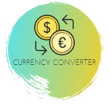

<h1 align="center">
    
</h1>

<h2 align="center">CURRENCY CONVERTER</h2>

This project is a currency converter developed with React.js

## Technologies

- JavaScript;
- React.Js;
- Html5;
- Css3;

### PRESENTATION

### Demonstration

---
Learning and Development - by Felipe Fontoura :wave: [See my linkedin!] (https://www.linkedin.com/in/fontourafelipe/)
